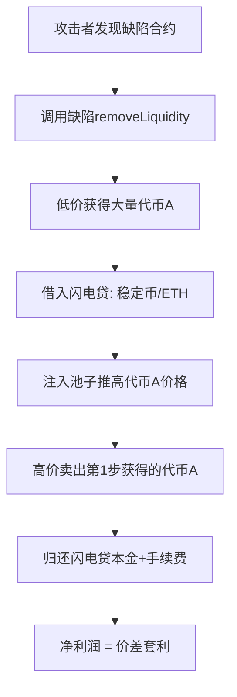

# 流动性计算缺陷利用攻击 - Flawed Liquidity Calculation Exploit

## 攻击模式概述

攻击者利用未验证合约中**错误的LP份额计算逻辑**，以极低成本获得大量代币，然后通过闪电贷推高价格后高价卖出，完成"低买高卖"套利。

**核心特征**：
- 存在未验证的中介合约处理流动性操作
- LP份额计算基于**错误的输入**（如买入金额而非实际份额比例）
- 攻击者通过缺陷函数获得远超正常价值的代币
- 使用闪电贷放大收益

---

## 典型攻击流程



**关键步骤**：
1. **发现缺陷函数**：通过反编译未验证合约，识别LP计算逻辑错误
2. **低成本获取**：调用缺陷函数，输入参数经过精心计算以最大化代币获取
3. **价格操纵**：借入大额闪电贷，推高目标代币价格
4. **套利完成**：在高价时卖出第1步获得的便宜代币
5. **清算退出**：归还闪电贷，保留利润

---

## 真实案例：RWB代币攻击

### 基本信息
- **交易哈希**: `0xcc1884e9934d516df9d80a38706bc0fa1d4437e0cd3d02a4b2e4e95fafe94dfe`
- **链**: BSC (Binance Smart Chain)
- **损失金额**: ~$180,400 USD
- **攻击时间**: 2025年 (Block 67717829)
- **缺陷合约**: `0xd945361cae76913239b0aac7a5891adcd32b42d1` (未验证)

### 攻击时间线
```
T0: 攻击者调用0xd945合约的缺陷函数
    └─ 输入: 买入USDT金额相关参数
    
T1: 0xd945错误计算LP数量并调用PancakeRouter.removeLiquidity
    ├─ 输入LP数量: 56,221,215,611,909,453,424
    └─ 输出: 122,494,637 USDT + 25,899,018 RWB (便宜获得)

T2: 从8个V3池借入~203M USDT闪电贷
    └─ 用于操纵RWB价格

T3-T5: 多次swap操作
    ├─ 注入大量USDT到池子
    ├─ RWB价格被推高数十倍
    └─ 销毁部分RWB进一步操纵储备比例

T6: 高价卖出T1步骤获得的25.89M RWB
    └─ 获得远超成本的USDT

T7: 归还闪电贷本金+手续费
    └─ 净利润: ~$180.4K
```

### 缺陷函数反编译分析

```solidity
// 0xd945合约的缺陷函数 (反编译)
function 0xcd0f8cb1(uint256 varg0) public nonPayable {
    require(msg.data.length - 4 >= 32);
    require(!mapping_10[varg0], Error('This ID has already been redeemed'));
    
    // 从mapping中读取预设参数
    v0.word0 = mapping_17[varg0].field0;
    v0.word1 = mapping_17[varg0].field1_0_19;  // 某个地址
    v0.word2 = mapping_17[varg0].field2_0_19;  // 某个地址
    v0.word3 = mapping_17[varg0].field3;       // LP数量参数
    v0.word4 = mapping_17[varg0].field4;
    
    // 验证调用者
    require(msg.sender == address(v0.word1), Error('error'));
    
    // 读取池子合约的LP余额
    v2 = _c_pair.balanceOf(address(this)).gas(msg.gas);
    
    // ⚠️ 关键缺陷：这里只检查余额是否足够，但v0.word3是预先计算的
    // 计算可能基于买入金额而非正常的LP份额比例
    require(v2 >= v0.word3, Error('Insufficient LP balance'));
    
    // ⚠️ 使用错误计算的LP数量调用removeLiquidity
    v3, v4, v5 = stor_11_0_19.removeLiquidity(
        stor_1_0_19,        // token0 (USDT)
        stor_2_0_19,        // token1 (RWB)
        v0.word3,           // ⚠️ 错误的LP数量
        0,                  // amountAMin (无滑点保护)
        0,                  // amountBMin (无滑点保护)
        address(this),
        block.timestamp + 300
    ).gas(msg.gas);
    
    // 返回的代币数量远超正常值
}
```

**缺陷分析**：
1. `v0.word3` (LP数量) 的计算逻辑在链下或预先设置
2. 很可能基于"用户支付的USDT金额"反推LP数量
3. 这种计算方式允许攻击者用很少成本获得大量LP对应的代币
4. 缺少对LP数量合理性的验证

---

## 常见缺陷代码模式

### ❌ 错误模式1：基于输入金额计算LP

```solidity
// 危险：允许用户通过输入金额反推LP数量
function removeLiquidity(uint256 tokenAmount) external {
    // ⚠️ 错误：LP数量不应该从代币金额直接计算
    uint256 lpToRemove = calculateLPFromTokenAmount(tokenAmount);
    
    // 可能导致攻击者获得远超其应得的代币
    (uint256 amount0, uint256 amount1) = router.removeLiquidity(
        token0,
        token1,
        lpToRemove,  // 错误计算的LP数量
        0,
        0,
        msg.sender,
        block.timestamp + 300
    );
}
```

### ❌ 错误模式2：缺少LP余额验证

```solidity
// 危险：未验证用户是否真的持有这么多LP
function removeLiquidity(uint256 lpAmount) external {
    // ⚠️ 缺少验证：用户实际LP余额检查
    
    router.removeLiquidity(
        token0,
        token1,
        lpAmount,  // 可能是任意值
        0,
        0,
        msg.sender,
        deadline
    );
}
```

### ❌ 错误模式3：使用可操纵的价格计算

```solidity
// 危险：基于当前价格计算LP，价格可被闪电贷操纵
function removeLiquidity(uint256 usdtAmount) external {
    // ⚠️ currentPrice可被闪电贷操纵
    uint256 currentPrice = getPrice();
    uint256 lpAmount = usdtAmount * currentPrice / K_CONSTANT;
    
    router.removeLiquidity(..., lpAmount, ...);
}
```

### ✅ 正确模式：基于用户实际LP份额

```solidity
// ✅ 正确：直接使用用户持有的LP份额
function removeLiquidity(uint256 lpAmount) external {
    address lpToken = getPairAddress(token0, token1);
    
    // ✅ 验证用户实际持有的LP
    uint256 userBalance = IERC20(lpToken).balanceOf(msg.sender);
    require(lpAmount <= userBalance, "Insufficient LP balance");
    
    // ✅ 转移用户的LP到合约
    IERC20(lpToken).transferFrom(msg.sender, address(this), lpAmount);
    
    // ✅ 使用正确的LP数量移除流动性
    (uint256 amount0, uint256 amount1) = router.removeLiquidity(
        token0,
        token1,
        lpAmount,
        amountAMin,  // ✅ 添加滑点保护
        amountBMin,  // ✅ 添加滑点保护
        msg.sender,
        deadline
    );
    
    // ✅ 可选：验证输出合理性
    require(amount0 >= minExpected0 && amount1 >= minExpected1, "Output too low");
}
```

---

## 检测清单

### 阶段1：识别可疑合约 (最高优先级)

- [ ] **是否有未验证合约参与流动性操作？**
  - 在trace中查找removeLiquidity/addLiquidity的调用者
  - 检查该合约是否在区块链浏览器上已验证
  
- [ ] **该合约是否是唯一或主要的LP操作者？**
  - 是否绕过了正常的Router/Factory流程
  
- [ ] **是否存在异常的代币流出量？**
  - 对比输入成本 vs 获得代币的市场价值
  - 计算价值不对等比例

### 阶段2：反编译分析

- [ ] **获取未验证合约的反编译代码**
  - 使用Etherscan/BscScan的反编译功能
  - 或使用Dedaub/Heimdall等工具
  
- [ ] **定位LP操作相关函数**
  - 查找调用router.removeLiquidity的函数
  - 分析该函数的参数来源
  
- [ ] **检查LP数量计算逻辑**
  - LP数量是否从用户输入的代币金额计算？
  - 是否从mapping/storage读取预设值？
  - 计算公式是否合理？
  
- [ ] **验证是否有必要的检查**
  - 是否验证用户LP余额？
  - 是否有滑点保护？
  - 是否验证输出合理性？

### 阶段3：经济模型验证

- [ ] **计算攻击者投入成本 vs 获得价值**
  ```
  投入成本 = Gas费 + (如需)预付代币金额
  获得价值 = 移除流动性返回的代币市场价值
  不对等比例 = 获得价值 / 投入成本
  
  ⚠️ 如果比例 > 10x，高度可疑
  ```

- [ ] **分析LP计算是否基于错误假设**
  - 正常LP移除：用户份额 / 总LP供应量 × 池子储备
  - 错误计算：基于输入金额反推LP数量

- [ ] **验证后续价格操纵是否为放大收益**
  - 第一步是否已获得便宜代币？
  - 闪电贷是否用于推高价格？
  - 是否存在"低买高卖"套利模式？

### 阶段4：攻击链完整性

- [ ] **确认攻击起点**
  - 攻击者第一笔异常获利在哪里？
  - 是removeLiquidity还是其他函数？
  
- [ ] **分析攻击链条**
  ```
  缺陷获取 → 价格操纵 → 套利完成
      ↓           ↓           ↓
   便宜代币   闪电贷推高   高价卖出
  ```
  
- [ ] **验证根因归属**
  - 如果修复LP计算缺陷，攻击是否还能成功？
  - 价格操纵是独立漏洞还是放大器？

---

## 误判警示

### 常见误判模式

**❌ 误判1：将表象当根因**
```
看到：sync()被调用，储备变化
错误结论：sync()权限控制缺失
正确分析：追溯到removeLiquidity返回异常，发现未验证合约缺陷
```

**❌ 误判2：被闪电贷误导**
```
看到：大额闪电贷
错误结论：闪电贷攻击
正确分析：闪电贷只是放大收益的工具，真正根因是LP计算缺陷
```

**❌ 误判3：忽视未验证合约**
```
看到：未验证合约参与
错误做法：仅作为次要信息记录
正确做法：最高优先级反编译分析业务逻辑
```

### 正确分析路径

```
Step 1: 发现removeLiquidity返回异常多的代币
   ↓
Step 2: 识别调用者是未验证合约0xd945
   ↓
Step 3: 反编译发现LP数量基于v0.word3参数
   ↓
Step 4: 分析参数来源，发现计算逻辑缺陷
   ↓
Step 5: 确认根因：LP计算基于输入金额而非份额比例
   ↓
Step 6: 理解后续链条：价格操纵是放大收益的手段
```

---

## 防御建议

### 开发者

1. **永远不要基于输入金额计算LP份额**
   ```solidity
   // ❌ 禁止
   lpAmount = f(userInputAmount)
   
   // ✅ 正确
   lpAmount = userSpecifiedLP
   require(lpAmount <= lpToken.balanceOf(user))
   ```

2. **必须验证用户实际持有的LP余额**
   ```solidity
   uint256 userLP = lpToken.balanceOf(msg.sender);
   require(requestedLP <= userLP, "Insufficient LP");
   ```

3. **使用恒定乘积公式验证输出合理性**
   ```solidity
   // xy = k原则
   require(
       (reserve0 - amount0) * (reserve1 - amount1) >= k,
       "Output breaks invariant"
   );
   ```

4. **添加滑点保护和最小输出检查**
   ```solidity
   router.removeLiquidity(
       ...,
       amountAMin,  // 用户指定的最小接受量
       amountBMin,
       ...
   );
   ```

5. **关键合约必须验证并审计**
   - 涉及资金操作的合约必须公开源代码
   - 通过专业安全公司审计
   - 实施时间锁和多签治理

### 审计者

1. **重点检查未验证合约的业务逻辑**
   - 优先反编译未验证但处理关键操作的合约
   - 分析LP/代币数量的计算来源

2. **验证LP计算公式是否基于正确的份额比例**
   ```
   正确：LP数量 = 用户份额 / 总LP供应量 × 常数
   错误：LP数量 = 用户输入金额 × 某个系数
   ```

3. **检查是否存在"输入→LP"的直接映射**
   - 追踪LP数量参数的数据流
   - 确认是否可被攻击者操纵

4. **模拟攻击场景验证经济模型**
   - 计算最坏情况下的可能损失
   - 验证是否存在无风险套利机会

### 用户/投资者

1. **警惕涉及未验证合约的项目**
2. **检查流动性池的LP分布是否异常**
3. **观察是否有大额单笔移除流动性后立即卖出的模式**
4. **使用区块链浏览器验证合约代码**

---

## 相关漏洞类型

- **CWE-682**: Incorrect Calculation（计算错误）
- **CWE-841**: Improper Enforcement of Behavioral Workflow（行为流程执行不当）
- **Business Logic Flaw**: 业务逻辑缺陷
- **Economic Model Exploitation**: 经济模型利用

---

## 易混淆模式对比

| 特征 | 流动性计算缺陷 | 价格操纵攻击 | Vault访问控制缺失 |
|------|---------------|-------------|------------------|
| 根因 | LP计算逻辑错误 | 储备/价格被操纵 | 缺少权限检查 |
| 攻击起点 | removeLiquidity | swap/addLiquidity | withdraw/redeem |
| 是否需要闪电贷 | 可选（用于放大） | 必需 | 通常不需要 |
| 代码缺陷位置 | 未验证合约 | AMM池合约 | Vault合约 |
| 修复方式 | 修正LP计算公式 | 添加TWAP/延迟 | 添加权限检查 |

**与本案例最易混淆的是价格操纵攻击**，因为都涉及：
- 闪电贷
- swap操作
- 价格变化

**区分关键**：
- 流动性计算缺陷：攻击者**第一步就获得了便宜代币**，后续是套利
- 纯价格操纵：攻击者依赖**瞬时价格操纵**完成获利，没有预先低价获取

---

## 总结

**核心教训**：
1. 未验证合约是最高风险点，必须优先深度分析
2. LP份额计算必须基于实际份额比例，不能从输入金额反推
3. 分析攻击时要追溯攻击起点，不要被后续操纵步骤误导
4. "低买高卖"套利模式的核心在第一步"低买"，而非"高卖"

**检测口诀**：
```
看到未验证合约，立即反编译；
追踪异常获利点，定位第一笔；
LP计算必验证，份额逻辑清；
价格操纵是表象，根因在逻辑。
```
